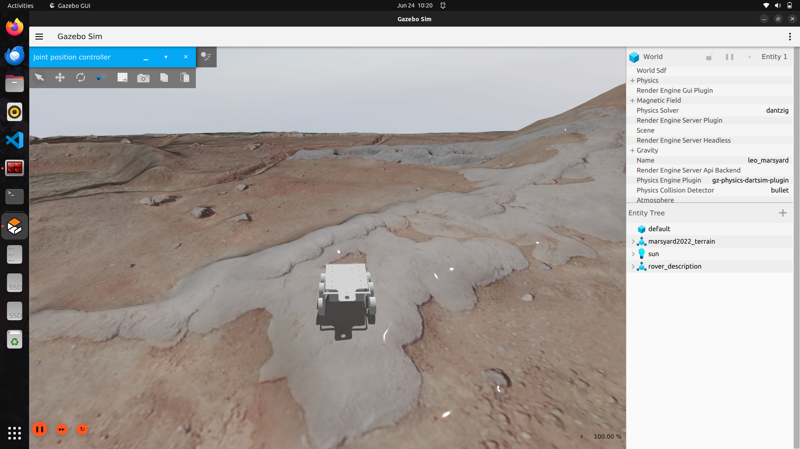
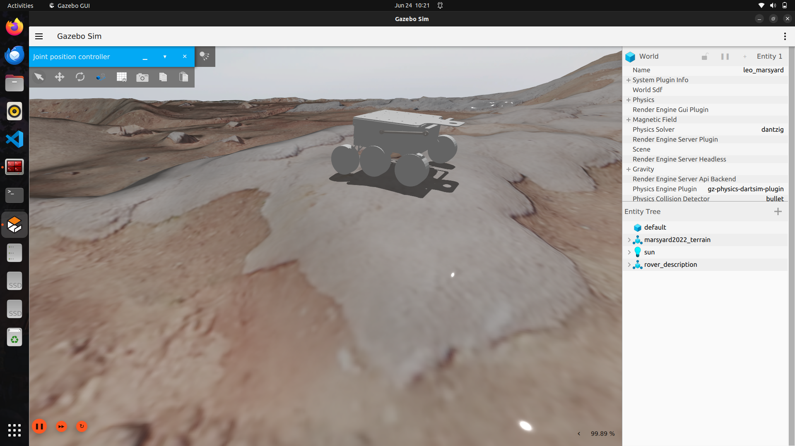
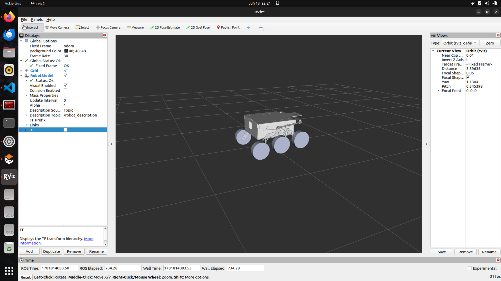
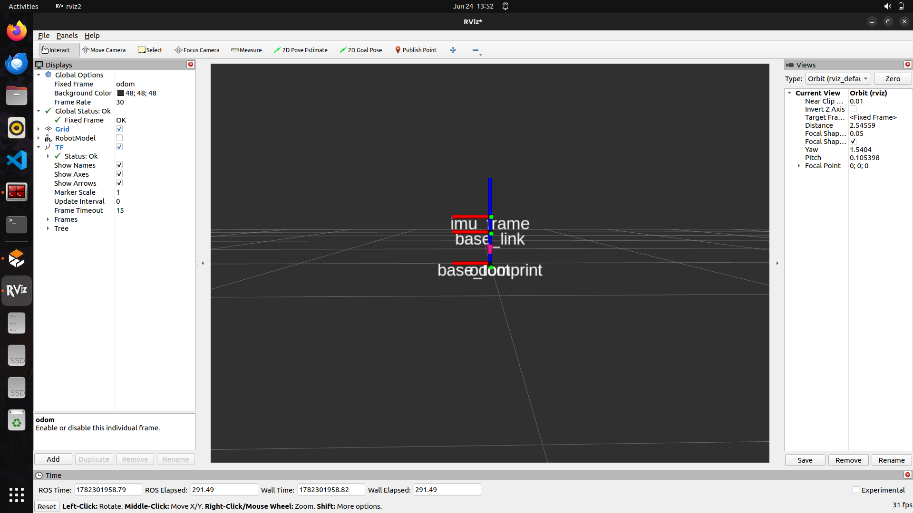
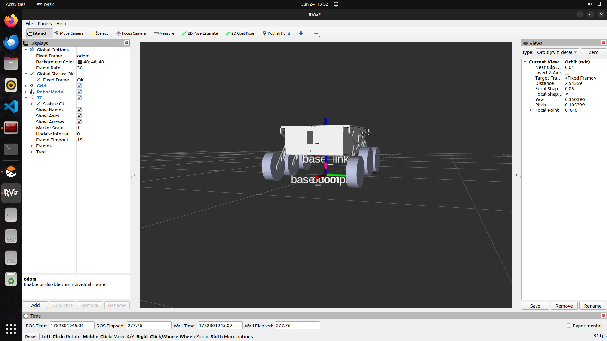
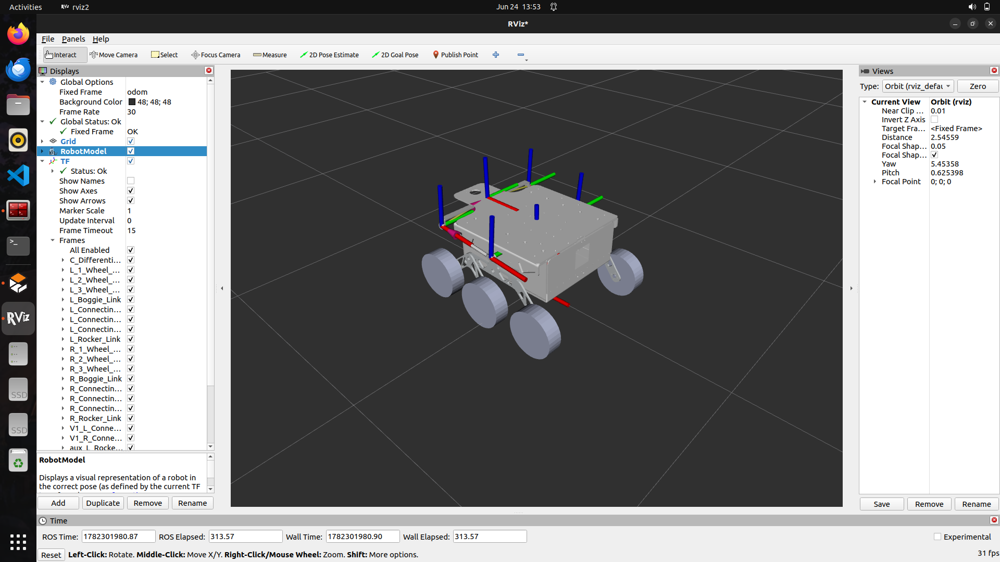

# Mars Rover — HSM Aries Leapone

ROS 2 (Humble) workspace for **HSM Aries Leapone**, a 6-wheel rocker-bogie
Mars rover built for the [European Rover Challenge](https://roverchallenge.eu/)
(ERC). This repo covers the robot description/simulation, drive controllers,
and sensor data processing needed to drive the rover in Gazebo or on real
hardware.

The European Rover Challenge is an international competition where student
teams design, build, and field a Mars-analogue rover to complete tasks such
as autonomous navigation, science sample collection, and remote-controlled
maintenance, scored against real-world planetary exploration scenarios.

Aries Leapone currently performs 5-point autonomous navigation with under
10% position error.

## Packages in this repo

- **rover_description** — URDF/xacro robot model, meshes, RViz configs, and
  Gazebo worlds (`marsyard.sdf`, `rubicon.sdf`, `test_world.sdf`). Launch
  files for displaying the robot (`display.launch.xml`), running it in
  simulation (`my_robot.launch.py`), driving the real robot
  (`real_robot.launch.py`), and waypoint navigation
  (`waypoint_nav.launch.xml`). Also includes keyboard teleop, a virtual
  differential script, and a waypoint follower.
- **rover_controllers** — `ros2_control` differential drive controller
  configuration, joystick teleop config, an ODrive CAN hardware interface,
  and weighted odometry computation.
- **data_process** — Python package for processing IMU data.

## Required external repos

This workspace depends on packages that live in separate repositories and
are **not included here**. Clone them into the same `src/` folder before
building:

| Package | Source | Purpose |
|---|---|---|
| [ros_odrive](https://github.com/odriverobotics/ros_odrive) | odriverobotics | ROS 2 driver for ODrive motor controllers, used by `rover_controllers` to drive the wheel motors over CAN. |
| [rover_nav](https://github.com/ronoroa-2000/rover_nav) | ronoroa-2000 | Navigation stack for the rover. |

```bash
cd ~/mars-rover/src
git clone https://github.com/odriverobotics/ros_odrive.git
git clone https://github.com/ronoroa-2000/rover_nav.git
```

## Building

```bash
cd ~/mars-rover
colcon build
source install/setup.bash
```

## Running

Simulation in Gazebo:
```bash
ros2 launch rover_description my_robot.launch.py
```

Real robot:
```bash
ros2 launch rover_description real_robot.launch.py
```

### Screenshots

Gazebo simulation on the Mars Yard terrain:




RViz visualization of the robot model and TF tree:





